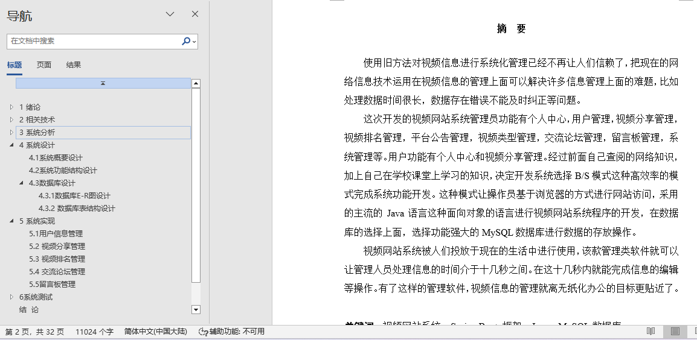
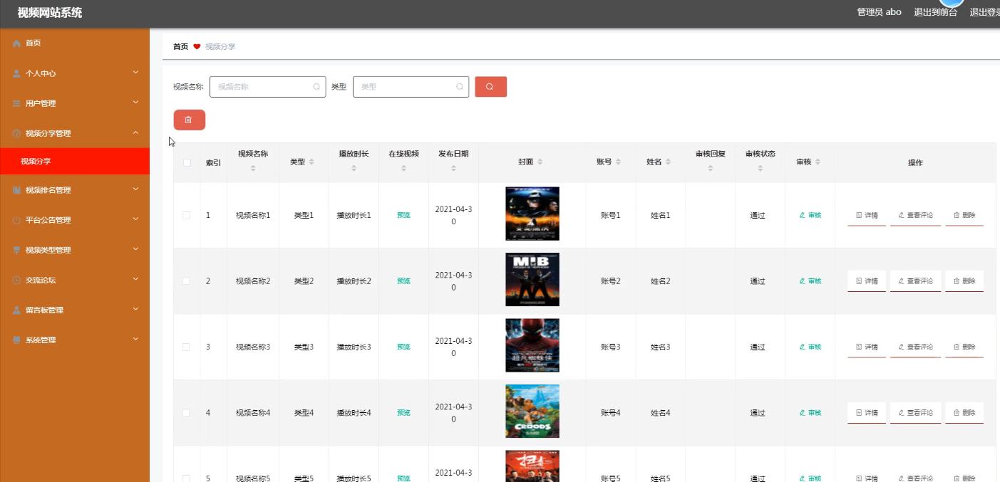
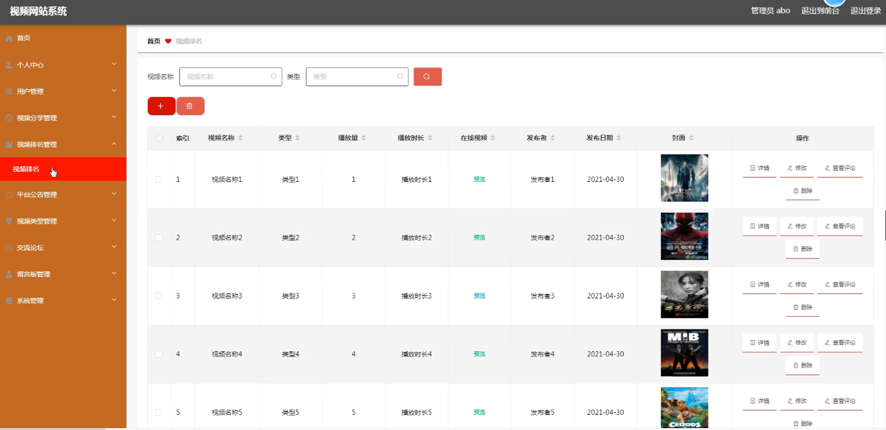
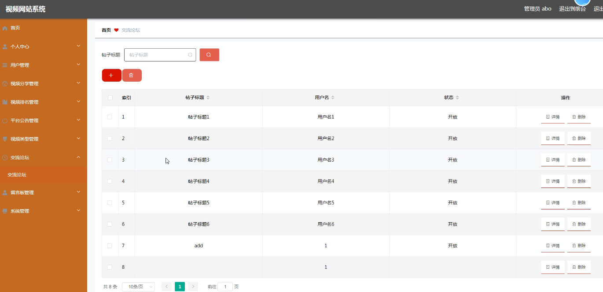
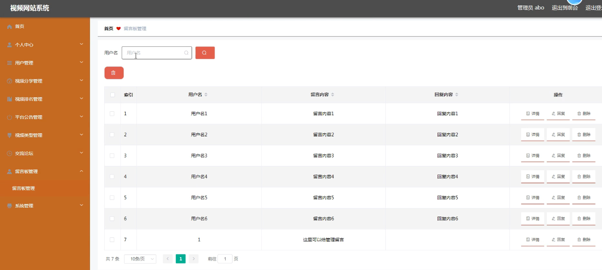
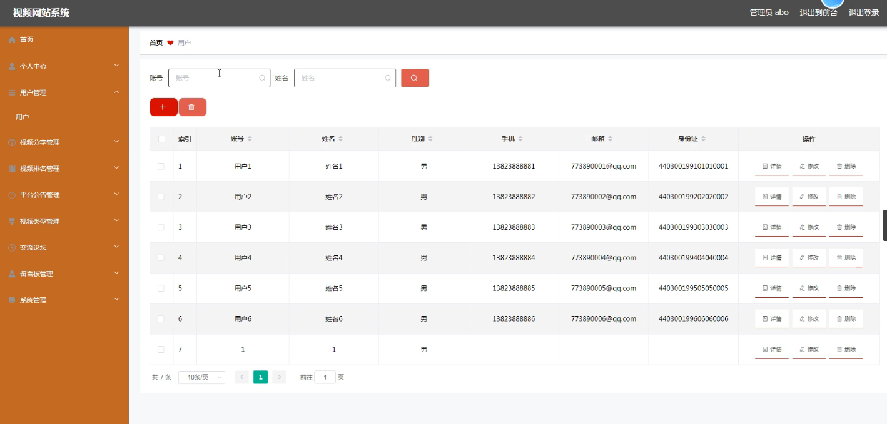

## 视频网站系统(程序+报告)

###  获取sql数据库文件: 从戎源码网 (https://armycodes.com/) QQ: 386869957 QQ群: 377586148
###  所有系统地址: (https://github.com/YuLin-Coder/AllProjectCatalog) 
###  所有项目以及源代码本人均调试运行无问题 可支持远程安装部署调试、定制修改、代码讲解

## 项目介绍
视频网站系统，系统包含两种角色：用户、管理员，系统分为前台和后台两大模块，主要功能如下：

 用户信息管理
管理员可以对用户信息进行添加、修改、删除操作。

 视频分享管理
管理员可以对视频分享进行管理，包括添加、修改和删除视频分享信息。

 视频排名管理
管理员可以管理视频排名信息，支持添加、修改和删除操作.

 交流论坛管理
管理员负责管理交流论坛的内容，包括添加、修改和删除交流论坛信息。

 留言板管理
管理员可以对留言板信息进行管理，包括添加、修改和删除操作。

## 项目技术
- 编程语言：Java
- 数据库：MySQL
- 项目管理工具：Maven
- 前端技术：HTML、CSS、JavaScript、Vue
- 后端技术：Spring、SpringMVC、MyBatis

## 运行环境
- JDK版本：JDK1.8及以上
- 开发工具：IDEA、Ecplise、Myecplise都可以
- 数据库: MySQL5.7及以上
- Maven：maven3.0及以上
- Node：14.14.0及以上

## 运行截图

